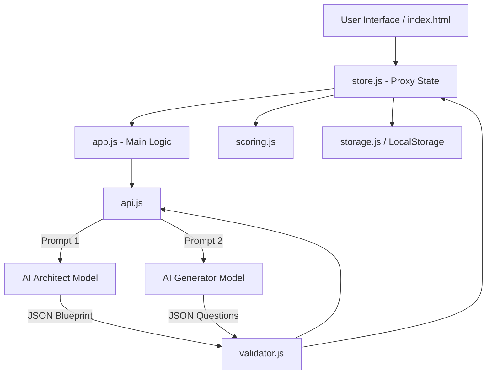

# AI Universal Test Generator (Евдокия Тестикова)

A client-side, single-page web application that uses AI to generate psychometric tests, trivia quizzes, and interactive "duel" challenges. Powered by Gemini/OpenRouter with a premium glassmorphism-styled frontend and full PWA support.

## What It Does

This project automatically constructs highly customized psychological tests and knowledge quizzes on the fly based on user prompts. Unlike static quiz platforms, it uses a two-step AI architecture (Architect -> Generator) to proactively build scientifically-sound dimensional or categorical psychometric frameworks, and then populates them with strictly validated questions. It operates entirely in the browser without a backend server.

## Current Status

**Production-ish / MVP**
The application is fully functional, supporting generation, state management, complex AI orchestrations with multi-provider failovers, and client-side PWA features.
_Gap:_ Because it lacks a backend, the "Duel" functionality relies purely on URL hash compression (`lz-string`), which may hit length limits on exceptionally large tests.

## Features

- **Тестикул (Psy):** Psychometric test generation based on Likert scales (1–5). Uses a robust v3.0 Architectural Prompting system (Construct -> Facets -> Questions).
- **Виктория (Quiz):** Knowledge quizzes with 2–4 options, variable difficulties, and instant scoring.
- **Дуэль (Duel):** Challenge friends by sharing test results via compressed short URLs (`#d=...`).
- **Client-Side Only:** No database or backend required. All API calls go directly to OpenRouter or Gemini.
- **PWA Ready:** Installable progressive web app with Service Worker caching (`sw.js`).
- **Reactive State:** A custom Proxy-based Pub/Sub state manager (`store.js`) for reactive UI updates without React/Vue.
- **Dynamic Imports:** Modules like `lz-string` are loaded on-the-fly to reduce initial bundle sizes.
- **Resilience:** Automatic JSON schema validation and retry loops for AI hallucinations.
- **Library:** Validated tests are automatically saved into `localStorage` for future replays.

## Non-Goals / Limitations

- **No Centralized Database:** Global leaderboards or user accounts are not currently supported.
- **Exposed API Keys:** Users must provide their own Gemini or OpenRouter API keys in the interface, as the app is serverless.
- **URL Length Limits:** Extremely long tests shared via "Duel" mode may theoretically exceed browser length limits for hashtags.

## Architecture

- **UI/View Layer:** Vanilla HTML/CSS with modular JS functionality.
- **State Manager:** A reactive `Proxy` object that emits events on modification.
- **AI Orchestrator:** An Architect model creates the rubric (blueprint), and a Generator model writes the questions matching the rubric.
- **Client/Server Boundary:** The boundary ends at the browser. The only external requests are to official AI provider endpoints (`generativelanguage.googleapis.com` or `openrouter.ai`).



## Repository Structure

| Path                  | Purpose                                                                              |
| --------------------- | ------------------------------------------------------------------------------------ |
| `/`                   | Root config files (`package.json`, `playwright.config.js`, `vitest.config.js`, etc.) |
| `index.html`          | Core application document and UI container                                           |
| `style.css`           | CSS variables, glassmorphism design, responsive layouts                              |
| `sw.js`               | Service Worker for offline caching and PWA support                                   |
| `manifest.json`       | Web App Manifest defining icon and display properties                                |
| `src/app.js`          | Main state machine connecting UI forms to AI APIs and rendering                      |
| `src/api.js`          | Network abstraction for Gemini & OpenRouter APIs                                     |
| `src/app-settings.js` | Prompts, JSON Schemas, and AI model configurations                                   |
| `src/store.js`        | A Proxy-based reactive UI event bus                                                  |
| `src/validator.js`    | Runtime JSON validator to ensure generated tests are usable                          |
| `src/scoring.js`      | Pure mathematical scoring engine for Psy test dimensions                             |
| `src/storage.js`      | `localStorage` wrapper to save and load generated tests                              |
| `src/utils.js`        | HTML escaping, logging, and general utility functions                                |
| `tests/`              | Unit (`*.test.js`) and End-to-End (`e2e/*.spec.js`) test suites                      |
| `.github/workflows/`  | CI pipeline configuration (`ci.yml`)                                                 |

## Tech Stack

| Layer             | Technology                | Purpose                                                       |
| ----------------- | ------------------------- | ------------------------------------------------------------- |
| **Frontend UI**   | Vanilla JS, HTML, CSS     | Lightweight, dependency-free interface                        |
| **State**         | Native JS `Proxy`         | Minimal reactive pub/sub architecture                         |
| **Bundler / Dev** | Vite                      | Fast local development and production asset building          |
| **AI Providers**  | Gemini 2.5, OpenRouter    | Generative engines for content creation                       |
| **Unit Testing**  | Vitest                    | Fast local testing for discrete algorithmic modules           |
| **E2E Testing**   | Playwright                | Full browser-level functional verification                    |
| **Linting**       | Biome, TypeScript (Check) | Static analysis, code formatting, and type-checking via JSDoc |

## Setup

1. Clone the repository.
2. Ensure you have Node.js installed (v20+ recommended).
3. Install dependencies:
   ```bash
   npm install
   ```

## Configuration

Since this is a backend-less application, all environment context comes directly from user input.

| Variable       | Required | Default | Description                                                        | Used In               |
| -------------- | -------- | ------- | ------------------------------------------------------------------ | --------------------- |
| `user_api_key` | **Yes**  | _None_  | Must be provided in the UI. Stored persistently in `localStorage`. | `src/api.js`, UI Form |

## Run

To start the local Vite development server:

```bash
npm run dev
```

Navigate to `http://localhost:5173` in your browser.

## Scripts

| Command           | Purpose                                                        |
| ----------------- | -------------------------------------------------------------- |
| `npm run dev`     | Starts the Vite dev server with hot-module replacement (HMR)   |
| `npm run build`   | Compiles and minifies the application to the `dist/` directory |
| `npm run preview` | Serves the production `dist/` build locally                    |
| `npm run test`    | Runs the Vitest unit testing suite                             |

## Testing

The project uses a two-tiered testing approach, enforced via GitHub Actions.

- **Unit Tests (`tests/*.test.js`):** Test decoupled engines (`scoring.js`, `storage.js`, `utils.js`). Run using Vitest.
- **E2E Tests (`tests/e2e/*.spec.js`):** Tests the main UI navigation and Playwright mocks the AI API responses to prevent burning external credits.

| Test Type      | Tooling     | Command                         | Scope                                                       |
| -------------- | ----------- | ------------------------------- | ----------------------------------------------------------- |
| Unit / Logic   | Vitest      | `npm run test`                  | Mathematical scoring, strict input filtering, array mapping |
| End-to-End     | Playwright  | `npx playwright test`           | Browser workflows, component display, DOM manipulation      |
| Static / Types | Biome + TSC | `npx @biomejs/biome check src/` | Code style enforcement and JSDoc type inferences            |

## API / Events / Contracts

### External API Requests

- **Endpoint 1:** `https://generativelanguage.googleapis.com/v1beta/models/...:generateContent` (Gemini)
- **Endpoint 2:** `https://openrouter.ai/api/v1/chat/completions` (OpenRouter)
- **Payloads:** Expects strictly formatted JSON adhering to blueprints defined in `SCHEMAS` (`src/app-settings.js`).

### Duel "Contracts" (Payload Structure)

Duel links map testing state to heavily compressed URL hashes:

```json
{
  "h": "HostName",
  "s": 12,
  "r": "Result Title",
  "t": { "theme": "...", "testType": "quiz" },
  "q": [{ "text": "Q1" }]
}
```

_Passed into `LZString.compressToEncodedURIComponent(JSON.stringify(payload))` resulting in `#d=...`_

## Main User Flows

**1. Generating a Test**

- **Preconditions:** User inputs Topic, Target Audience, and an API Key.
- **Steps:**
  1. Internal validation checks API key prefix.
  2. UI displays Loading screen.
  3. App calls "Architect" prompt, waits for JSON blueprint.
  4. App calls "Generator" prompt passing the blueprint, waits for JSON questions.
  5. UI loads the first generated question.
- **Expected Outcome:** User sees Question 1 and the Likert/Quiz selection buttons.

**2. Playing a Duel**

- **Preconditions:** User clicks on a `#d=...` hash link shared by a friend.
- **Steps:**
  1. Application intercepts the hash on load (`window.onpopstate`).
  2. `lz-string` decompresses the JSON payload safely.
  3. Pre-test prompt tells the user the Host's score and asks if they accept the challenge.
  4. User answers the exact same pre-generated questions.
- **Expected Outcome:** Final screen displays comparison between the Host's score/result and the User's score/result.

## Troubleshooting

- **"Ошибка генерации / JSON Parse Error"**
  The AI failed to deliver clean JSON. The system attempts 3 automatic retries. If it fails, try making the topic less abstract.
- **Duel Link Fails to Load**
  Some browsers cap URL limits around 2048 characters. If a Psy test has heavily detailed results with 30+ questions, the `#d=` param will drop characters. Use shorter quizzes if intending to share heavily.
- **Tests Not Saving**
  Ensure the browser allows `localStorage`, and that the quota hasn't been exceeded.

## Known Documentation Gaps

- **Repository Structure Mismatch:** The previous README stated that PWA files (`manifest.json`, `sw.js`, `icon.svg`) were located inside a `public/` directory. They are actually located directly at the root.
- **Typescript Status:** The previous README only vaguely referenced TypeScript. In reality, the project uses heavily annotated JSDoc Vanilla JavaScript (`@type {HTMLInputElement}`, etc.) passing through `tsc --allowJs` instead of pure `.ts` files.

## Contributing

1. Keep it Vanilla: Do not introduce heavy frontend frameworks (React/Vue).
2. Code Splitting: Try to dynamically import libraries (`import()`) rather than cluttering the initial load.
3. Tests First: Run `npm run test` and `npx playwright test` before committing.
4. Pass CI: All code must pass Biome linting locally: `npx @biomejs/biome check src/`.

## License

ISC License (as specified in `package.json`).
